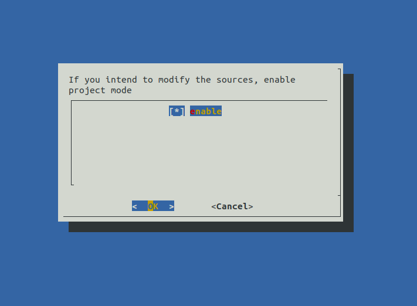

# Enclustra Build Environment - User Documentation

## Project Mode

For users who want to use the Enclustra Build Environment, but still be able to modify parts of the system, a ‘project mode’ is available.

Project mode is similar to regular mode, but enables users to fully customize all the parts of the system.

To enable project mode, choose ‘Advanced’ option on the very last screen of the GUI workflow.

Check the ‘enable’ option.

Continue as usual.

After the regular build has finished, the sources of the components that were chosen to be fetched, are going to be copied to the output directory. The user is free to modify those sources and add a git upstream to them to keep them versioned.

Besides the sources, a new build script called build.sh is generated. This script will run the Enclustra Build Environment in a special project mode. In this mode the step for choosing components to fetch is skipped, and the user is prompted to choose which of the components to build. If any of the components of the system were modified, the build system will build them, and include the output files in the final boot images.

Last Page: [Deployment](./4_Deployment.md)

Next Page: [Updating the binaries](./6_Binaries_Update.md)
